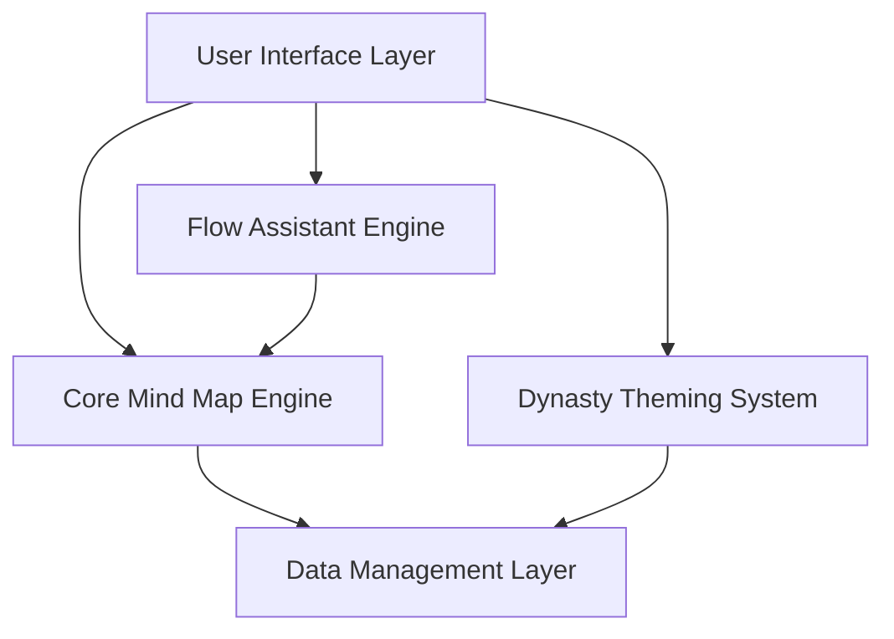
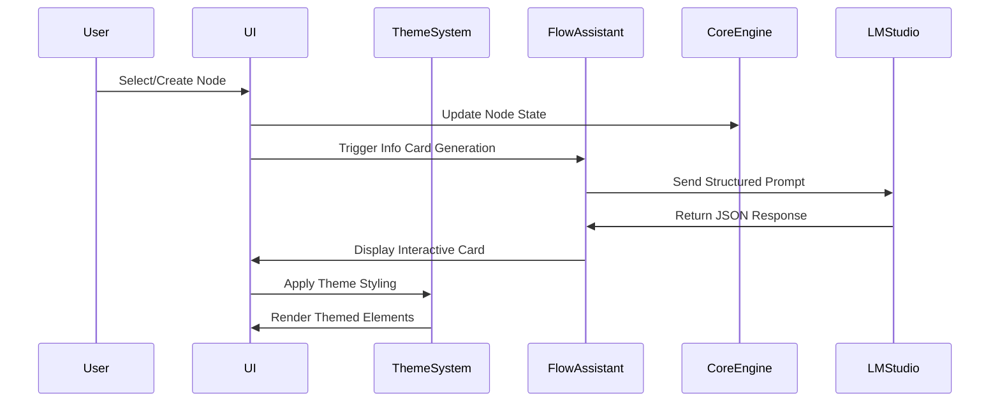

# CogniFlow v8.3 Upgrade Design Document

## Overview

The CogniFlow v8.3 upgrade transforms the application into a sophisticated AI-powered mind mapping tool with beautiful Kurzgesagt-inspired theming and intelligent interactive assistance. The design focuses on seamless integration of new features while maintaining the core simplicity and performance of the existing application.

## Architecture

### High-Level Architecture



### Component Interaction Flow



## Components and Interfaces

### 1. Dynasty Theming System

#### Theme Configuration Structure
```javascript
const dynastyThemes = {
  cosmicOcean: {
    name: 'Cosmic Ocean',
    canvasBackground: '#0D1117',
    colors: {
      centralNode: '#30363D',
      palette: ['#58A6FF', '#1F6FEB', '#A371F7', '#D2A8FF', '#F0883E', '#E4C52E', '#3FB950']
    },
    fonts: {
      heading: 'Lexend',
      subheading: 'Poppins', 
      body: 'Inter'
    },
    effects: {
      gradientIntensity: 0.15,
      shadowBlur: 30,
      shadowOpacity: 0.4
    }
  }
  // ... other themes
};
```

#### Theme Application Interface
```javascript
interface ThemeManager {
  applyTheme(themeName: string): Promise<void>
  loadThemeFonts(themeName: string): Promise<void>
  generateNodeStyle(color: string, depth: number): NodeStyle
  updateCSSVariables(theme: Theme): void
}

interface NodeStyle {
  backgroundColor: string
  backgroundImage: string
  boxShadow: string
  color: string
}
```

### 2. Enhanced Flow Assistant

#### Information Card Structure
```javascript
interface InfoCard {
  cardTitle: string
  sections: InfoSection[]
  proactiveNodeSuggestions: string[]
}

interface InfoSection {
  type: 'definition' | 'paragraph_info' | 'bullet_points' | 'question' | 'structural_tip'
  title: string
  content: string
  items?: string[]
}
```

#### Flow Assistant API Interface
```javascript
interface FlowAssistantAPI {
  generateInfoCard(context: NodeContext): Promise<InfoCard>
  buildContext(node: Node): NodeContext
  processInteraction(action: InteractionAction): void
}

interface NodeContext {
  currentNodeText: string
  currentNodeId: string
  parentNodeText?: string
  parentNodeId?: string
  siblingNodeTexts: string[]
  siblingNodeIds: string[]
  fullMapStructure: MapStructure[]
  mapGoal: string
}
```

### 3. Ghost Node System

#### Ghost Node Management
```javascript
interface GhostNodeManager {
  generateGhostNodes(parentNode: Node): GhostNode[]
  renderGhostNodes(ghostNodes: GhostNode[]): void
  clearGhostNodes(): void
  handleGhostNodeClick(ghostNode: GhostNode): Node
}

interface GhostNode {
  id: string
  text: string
  x: number
  y: number
  parentId: string
  opacity: number
  animation: 'breathing' | 'pulse'
}
```

### 4. Interactive UI Elements

#### Drag and Drop System
```javascript
interface DragDropManager {
  initializeDragHandlers(): void
  handleDragStart(element: HTMLElement, data: DragData): void
  handleDragOver(event: DragEvent): void
  handleDrop(event: DragEvent): void
  showDropTargets(dragType: string): void
  hideDropTargets(): void
}

interface DragData {
  type: 'highlighted-text' | 'bullet-point' | 'definition'
  content: string
  sourceCardId: string
  action: 'add-to-notes' | 'create-node' | 'to-input'
}
```

## Data Models

### Enhanced Node Structure
```javascript
interface EnhancedNode extends BaseNode {
  // Existing properties
  id: string
  name: string
  depth: number
  x: number
  y: number
  color: string
  
  // Enhanced properties
  notes: string[]
  listItems?: ListItem[]
  isListNode: boolean
  isMediaNode: boolean
  mediaType?: string
  mediaSrc?: string
  mediaMetadata: Record<string, any>
  createdAt: number
  lastModified: number
  
  // Theme-related properties
  themeColor?: string
  gradientStyle?: string
  shadowStyle?: string
}

interface ListItem {
  id: string
  text: string
  checked?: boolean
  createdAt: number
}
```

### Theme State Management
```javascript
interface ThemeState {
  currentTheme: string
  loadedFonts: Set<string>
  cssVariables: Record<string, string>
  dynastyPalettes: string[][]
  firstGenPaletteAssignment: Map<string, number>
}
```

### Flow Assistant State
```javascript
interface FlowAssistantState {
  active: boolean
  currentCard?: InfoCard
  conversationHistory: ConversationEntry[]
  lastUpdateTime: number
  ghostNodes: GhostNode[]
  interactionQueue: InteractionAction[]
}
```

## Error Handling

### API Error Management
```javascript
interface ErrorHandler {
  handleLMStudioError(error: APIError): void
  handleThemeLoadError(themeName: string, error: Error): void
  handleDragDropError(error: DragDropError): void
  showUserFriendlyError(message: string): void
}

// Error Recovery Strategies
const errorRecoveryStrategies = {
  lmStudioOffline: 'Show offline message, disable AI features gracefully',
  fontLoadFailure: 'Fallback to system fonts, log warning',
  jsonParseError: 'Show parsing error, request retry',
  dragDropFailure: 'Reset drag state, show error toast'
};
```

### Graceful Degradation
- **LM Studio Unavailable**: Disable AI features, show connection instructions
- **Font Loading Failure**: Use system font fallbacks
- **Theme Loading Error**: Revert to default theme
- **JSON Parsing Error**: Show error message, allow retry

## Testing Strategy

### Unit Testing
- **Theme System**: Test theme application, font loading, CSS variable updates
- **Flow Assistant**: Test API calls, JSON parsing, card generation
- **Ghost Nodes**: Test generation, positioning, interaction handling
- **Drag & Drop**: Test drag detection, drop target highlighting, content transfer

### Integration Testing
- **Theme + AI Integration**: Verify themed AI cards render correctly
- **Node Creation + Ghost Nodes**: Test ghost node updates after node creation
- **Drag & Drop + Node Updates**: Verify content addition updates node state
- **API + Error Handling**: Test error scenarios and recovery

### Performance Testing
- **Theme Switching**: Measure transition times, memory usage
- **AI Response Times**: Test local API response times under load
- **Ghost Node Rendering**: Measure D3.js rendering performance
- **Large Mind Maps**: Test performance with 100+ nodes

### User Experience Testing
- **Interaction Flows**: Test complete user workflows
- **Visual Consistency**: Verify theme consistency across all elements
- **Accessibility**: Test keyboard navigation, screen reader compatibility
- **Mobile Responsiveness**: Test touch interactions, responsive layouts

## Implementation Phases

### Phase 1: Dynasty Theming Foundation
1. Implement theme configuration structure
2. Create CSS variable management system
3. Add Google Fonts dynamic loading
4. Implement theme switching functionality
5. Update node rendering with gradients and shadows

### Phase 2: Enhanced Flow Assistant Core
1. Update LM Studio API integration for structured JSON
2. Implement information card generation
3. Create interactive card rendering system
4. Add click handlers for definitions and bullet points
5. Implement basic drag and drop for highlighted text

### Phase 3: Ghost Node System
1. Create ghost node data structures
2. Implement AI-driven suggestion generation
3. Add D3.js rendering for ghost nodes
4. Implement click-to-create functionality
5. Add animation and visual effects

### Phase 4: Advanced Interactions
1. Complete drag and drop system
2. Add visual feedback for all interactions
3. Implement node content management
4. Add error handling and recovery
5. Performance optimization and testing

### Phase 5: Polish and Integration
1. Comprehensive testing across all features
2. Performance optimization
3. Accessibility improvements
4. Documentation and user guides
5. Backward compatibility verification

## Technical Considerations

### Performance Optimizations
- **Debounced AI Calls**: Prevent excessive API requests during rapid interactions
- **Efficient D3.js Updates**: Use data binding patterns to minimize DOM manipulation
- **Font Loading Strategy**: Preload critical fonts, lazy load others
- **Memory Management**: Clean up ghost nodes and unused card data

### Browser Compatibility
- **Modern Browser Support**: Target Chrome 90+, Firefox 88+, Safari 14+
- **CSS Feature Detection**: Graceful fallbacks for advanced CSS features
- **JavaScript ES6+**: Use modern JavaScript with appropriate polyfills
- **Local Storage**: Enhanced data persistence with error handling

### Security Considerations
- **Local API Only**: No external API calls, all processing local
- **Input Sanitization**: Sanitize all user input and AI responses
- **XSS Prevention**: Proper HTML escaping for dynamic content
- **Data Privacy**: All data remains local, no external transmission